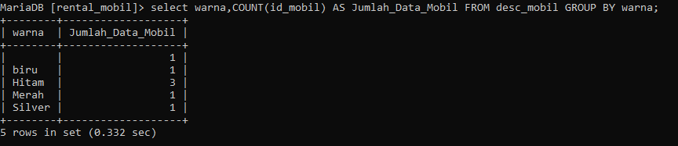
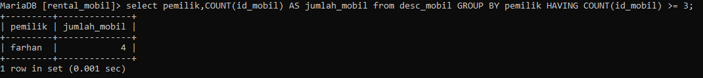
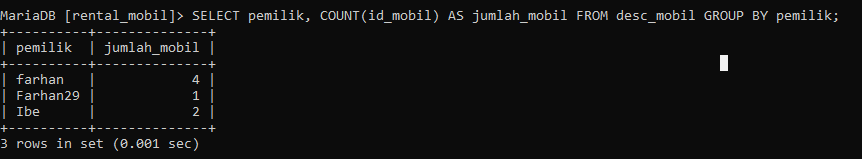
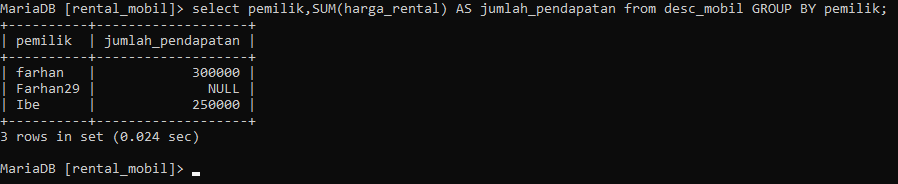
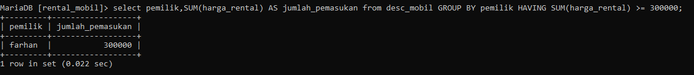
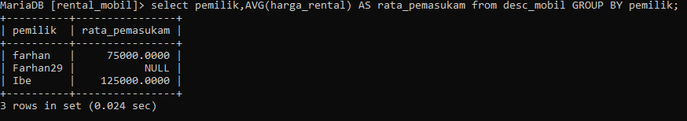
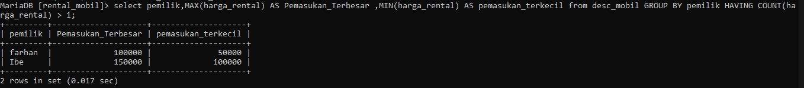

# TANTANGAN 
## 1.tampilkan jumlah data mobil dan kelompok kan berdasarkan warna nya sesuai dengan tabel mobil kalian.

### Struktur Query
```mysql
select nama_data,COUNT(nama_data) AS nama_sementara FROM nama_tabel GROUP BY nama_data;
```

### Query
```sql
select warna,COUNT(id_mobil) AS Jumlah_Data_Mobil FROM desc_mobil GROUP BY warna;
```

### Hasil


### Analisis
1. `SELECT warna, COUNT(id_mobil) AS Jumlah_Data_Mobil`:
    - Ini menunjukkan bahwa kita akan mengambil dua kolom dalam hasil query:
        - `warna`: Kolom yang berisi warna-warna mobil.
        - `Jumlah_Data_Mobil`: Jumlah data mobil untuk setiap warna, yang dihitung menggunakan fungsi `COUNT(id_mobil)`.
2. `FROM desc_mobil`:
    - Ini menunjukkan bahwa data diambil dari tabel bernama `desc_mobil`.
3. `GROUP BY warna`:
    - Ini berarti bahwa hasil query akan dikelompokkan berdasarkan nilai pada kolom `warna`.
### Kesimpulan
Jadi, query ini akan mengembalikan jumlah data mobil untuk setiap warna mobil yang ada dalam tabel `desc_mobil`. Hasil query ini dapat digunakan untuk analisis, misalnya untuk mengetahui warna mobil mana yang paling banyak atau paling sedikit.
## 2.berdasarkan query ini tampilkan yang lebih BESAR dari 3 atau sama dengan 3 pemilik mobil nya

### Struktur Query
```mysql
select nama_data,COUNT(nama_data) AS nama_sementara from nama_tabel GROUP BY nama_data HAVING COUNT(nama_data) >= 3;
```

### Query
```mysql
select pemilik,COUNT(id_mobil) AS jumlah_mobil from desc_mobil GROUP BY pemilik HAVING COUNT(id_mobil) >= 3;
```

### Hasil

### Analisis
1. `SELECT pemilik, COUNT(id_mobil) AS jumlah_mobil`:
    - Ini menunjukkan bahwa kita akan mengambil dua kolom dalam hasil query:
        - `pemilik`: Kolom yang berisi informasi pemilik mobil.
        - `jumlah_mobil`: Jumlah mobil yang dimiliki oleh masing-masing pemilik, yang dihitung menggunakan fungsi `COUNT(id_mobil)`.
2. `FROM desc_mobil`:
    - Ini menunjukkan bahwa data diambil dari tabel bernama `desc_mobil`.
3. `GROUP BY pemilik`:
    - Ini berarti bahwa hasil query akan dikelompokkan berdasarkan nilai pada kolom `pemilik`.
4. `HAVING COUNT(id_mobil) >= 3`:
    - Ini adalah kondisi tambahan yang diterapkan setelah pengelompokan data.
    - Kondisi ini memastikan bahwa hanya pemilik yang memiliki jumlah mobil `>= 3` yang akan ditampilkan dalam hasil query.
### Kesimpulan
Jadi, query ini akan menampilkan informasi pemilik dan jumlah mobil yang dimiliki, tetapi hanya untuk pemilik yang memiliki 3 atau lebih mobil. Ini dapat digunakan untuk mengidentifikasi pemilik yang memiliki banyak mobil dalam tabel `desc_mobil`.

## 3.tampilkan semua pemilik dengan jumlah mobilnya yang memiliki atau sama dengan 3 mobil
### Struktur Query
```mysql
SELECT nama_data,COUNT(nama_data) AS nama_sementara FROM nama_tabel GROUP BY nama_data;
```

### Query

```mysql
SELECT pemilik, 
COUNT(id_mobil) AS jumlah_mobil 
FROM desc_mobil GROUP BY pemilik;
```

### Hasil

### Analisis
- 1. `SELECT pemilik, COUNT(id_mobil) AS jumlah_mobil`:
    - Ini menunjukkan bahwa kita akan mengambil dua kolom dalam hasil query:
        - `pemilik`: Kolom yang berisi informasi pemilik mobil.
        - `jumlah_mobil`: Jumlah mobil yang dimiliki oleh masing-masing pemilik, yang dihitung menggunakan fungsi `COUNT(id_mobil)`.
2. `FROM desc_mobil`:
    - Ini menunjukkan bahwa data diambil dari tabel bernama `desc_mobil`.
3. `GROUP BY pemilik`:
    - Ini berarti bahwa hasil query akan dikelompokkan berdasarkan nilai pada kolom `pemilik`.
### Kesimpulan
Jadi, query ini akan menampilkan informasi pemilik dan jumlah mobil yang dimiliki oleh masing-masing pemilik. Hasil query ini dapat digunakan untuk mengetahui distribusi kepemilikan mobil dalam tabel `desc_mobil`.

Sebagai contoh, jika hasil query menunjukkan bahwa:

- Pemilik A memiliki 5 mobil
- Pemilik B memiliki 2 mobil
- Pemilik C memiliki 10 mobil

Maka kita dapat menyimpulkan bahwa pemilik C memiliki jumlah mobil terbanyak di antara pemilik-pemilik lainnya.
## 4.berdasarkan query yang ada pada praktikum 5 bagian 7 tampilkan data pada table mobil dengan mengelompokkan berdasarkan pemiliknya.hitung menggunakan sum total pendapatan pemilik berdasarkan harga rental

### Struktur Query

```mysql
select data 3,SUM(data 5) AS nama_sementara from nama_tabel GROUP BY data 3;
```
### Query
```mysql
select pemilik,SUM(harga_rental) AS jumlah_pendapatan from desc_mobil GROUP BY pemilik;
```
### Hasil

### Analisis
1. `SELECT pemilik, SUM(harga_rental) AS jumlah_pendapatan`:
    - Ini menunjukkan bahwa kita akan mengambil dua kolom dalam hasil query:
        - `pemilik`: Kolom yang berisi informasi pemilik mobil.
        - `jumlah_pendapatan`: Total pendapatan yang diperoleh oleh masing-masing pemilik, yang dihitung menggunakan fungsi `SUM(harga_rental)`.
2. `FROM desc_mobil`:
    - Ini menunjukkan bahwa data diambil dari tabel bernama `desc_mobil`.
3. `GROUP BY pemilik`:
    - Ini berarti bahwa hasil query akan dikelompokkan berdasarkan nilai pada kolom `pemilik`.

### Kesimpulan
Jadi, query ini akan menampilkan informasi pemilik dan total pendapatan yang diperoleh oleh masing-masing pemilik dari sewa mobil. Hasil query ini dapat digunakan untuk menganalisis pendapatan yang diperoleh oleh setiap pemilik mobil berdasarkan data dalam tabel `desc_mobil`.

Sebagai contoh, jika hasil query menunjukkan bahwa:

- Pemilik A memiliki total pendapatan sewa sebesar Rp 50.000.000
- Pemilik B memiliki total pendapatan sewa sebesar Rp 30.000.000
- Pemilik C memiliki total pendapatan sewa sebesar Rp 80.000.000

Maka kita dapat menyimpulkan bahwa pemilik C memiliki total pendapatan sewa mobil terbesar di antara pemilik-pemilik lainnya.
## 5. Berdasarkan praktikum 5 query no 8 tampilkan jumlah pemasukan pemilik berdasarkan harga rental kelompokkan berdasarkan pemiliknya dan seleksi yang total pemasukannya atau harga rentalnya mencapai lebih besar atau sama dengan 300k

### Struktur Query
```mysql
select data_mobil,SUM(data_mobil) AS nama_sementara from nama_tabel GROUP BY data_mobil HAVING SUM(data_mobil) >= 300000;
```
### Query
```mysql
select pemilik,SUM(harga_rental) AS jumlah_pemasukan from desc_mobil GROUP BY pemilik HAVING SUM(harga_rental) >= 300000;
```

### Hasil

### Analisis
1. `SELECT pemilik, SUM(harga_rental) AS jumlah_pemasukan`:
    - Ini menunjukkan bahwa kita akan mengambil dua kolom dalam hasil query:
        - `pemilik`: Kolom yang berisi informasi pemilik mobil.
        - `jumlah_pemasukan`: Total pemasukan yang diperoleh oleh masing-masing pemilik, yang dihitung menggunakan fungsi `SUM(harga_rental)`.
2. `FROM data_mobil`:
    - Ini menunjukkan bahwa data diambil dari tabel bernama `data_mobil`.
3. `GROUP BY pemilik`:
    - Ini berarti bahwa hasil query akan dikelompokkan berdasarkan nilai pada kolom `pemilik`.
4. `HAVING SUM(harga_rental) >= 300000`:
    - Ini adalah kondisi tambahan yang diterapkan setelah pengelompokan data.
    - Kondisi ini memastikan bahwa hanya pemilik yang memiliki total pemasukan sewa mobil `>= 300.000` yang akan ditampilkan dalam hasil query.
### Kesimpulan
Jadi, query ini akan menampilkan informasi pemilik dan total pemasukan sewa mobil yang diperoleh, tetapi hanya untuk pemilik yang memiliki total pemasukan sewa mobil lebih dari atau sama dengan Rp 300.000. Ini dapat digunakan untuk mengidentifikasi pemilik-pemilik yang memiliki pemasukan sewa mobil yang cukup besar dalam tabel `data_mobil`.

Sebagai contoh, jika hasil query menunjukkan:

- Pemilik A: Rp 500.000
- Pemilik B: Rp 800.000
- Pemilik C: Rp 350.000

Maka hanya pemilik B dan C yang akan ditampilkan, karena mereka memenuhi kondisi total pemasukan sewa mobil

## 6. Berdasarkan praktikum 6 no 12 tampilkan rata rata pemasukan pemilik mobil kelompokkan berdasarkan pemiliknya
### Struktur Query
```mysql
select nama_data,AVG(nama_data) AS nama_sementara from nama_tabel GROUP BY nama_data;
```

### Query 
```mysql
select pemilik,AVG(harga_rental) AS rata_pemasukam from desc_mobil GROUP BY pemilik;
```

### Hasil

### Analisis
1. `SELECT pemilik, SUM(harga_rental) AS jumlah_pemasukan`:
    - Ini menunjukkan bahwa kita akan mengambil dua kolom dalam hasil query:
        - `pemilik`: Kolom yang berisi informasi pemilik mobil.
        - `jumlah_pemasukan`: Total pemasukan yang diperoleh oleh masing-masing pemilik, yang dihitung menggunakan fungsi `SUM(harga_rental)`.
2. `FROM data_mobil`:
    - Ini menunjukkan bahwa data diambil dari tabel bernama `data_mobil`.
3. `GROUP BY pemilik`:
    - Ini berarti bahwa hasil query akan dikelompokkan berdasarkan nilai pada kolom `pemilik`.
4. `HAVING SUM(harga_rental) >= 300000`:
    - Ini adalah kondisi tambahan yang diterapkan setelah pengelompokan data.
    - Kondisi ini memastikan bahwa hanya pemilik yang memiliki total pemasukan sewa mobil `>= 300.000` yang akan ditampilkan dalam hasil query.
### Kesimpulan
Jadi, query ini akan menampilkan informasi pemilik dan total pemasukan sewa mobil yang diperoleh, tetapi hanya untuk pemilik yang memiliki total pemasukan sewa mobil lebih dari atau sama dengan Rp 300.000. Ini dapat digunakan untuk mengidentifikasi pemilik-pemilik yang memiliki pemasukan sewa mobil yang cukup besar dalam tabel `data_mobil`.

Sebagai contoh, jika hasil query menunjukkan:

- Pemilik A: Rp 500.000
- Pemilik B: Rp 800.000
- Pemilik C: Rp 350.000

Maka hanya pemilik B dan C yang akan ditampilkan, karena mereka memenuhi kondisi total pemasukan sewa mobil `>= 300.000`.
## 7. Berdasarkan praktikum 5 no 16 tampilkan pemasukan  terbesar dan pemasukan terkecil kelompokkan berdasarkan pemiliknya dan seleksi data pemilik yg tampil atau memiliki jumlah mobil lebih besar dari 1.

### Struktur Query
```mysql
select nama_data,MAX(nama_data) AS nama_sementara,MIN(nama_data) AS nama_sementara from nama_tabel GROUP BY nama_data HAVING COUNT(nama_data) >= 1;
```
### Query
```mysql
select pemilik,MAX(harga_rental) AS Pemasukan_Terbesar ,MIN(harga_rental) AS pemasukan_terkecil from desc_mobil GROUP BY pemilik HAVING COUNT(harga_rental) > 1;
```
### Hasil


### Analisis
1. `SELECT pemilik, MAX(harga_rental) AS Pemasukan_Terbesar, MIN(harga_rental) AS pemasukan_terkecil`:
    - Ini menunjukkan bahwa kita akan mengambil tiga kolom dalam hasil query:
        - `pemilik`: Kolom yang berisi informasi pemilik mobil.
        - `Pemasukan_Terbesar`: Nilai maksimum (terbesar) dari harga sewa mobil untuk masing-masing pemilik.
        - `pemasukan_terkecil`: Nilai minimum (terkecil) dari harga sewa mobil untuk masing-masing pemilik.
2. `FROM desc_mobil`:
    - Ini menunjukkan bahwa data diambil dari tabel bernama `desc_mobil`.
3. `GROUP BY pemilik`:
    - Ini berarti bahwa hasil query akan dikelompokkan berdasarkan nilai pada kolom `pemilik`.
4. `HAVING COUNT(harga_rental) > 1`:
    - Ini adalah kondisi tambahan yang diterapkan setelah pengelompokan data.
    - Kondisi ini memastikan bahwa hanya pemilik yang memiliki lebih dari satu harga sewa mobil (artinya, lebih dari satu mobil yang disewakan) yang akan ditampilkan dalam hasil query.
### Kesimpulan
Jadi, query ini akan menampilkan informasi pemilik, harga sewa mobil terbesar, dan harga sewa mobil terkecil, tetapi hanya untuk pemilik yang memiliki lebih dari satu harga sewa mobil dalam tabel `desc_mobil`.

Sebagai contoh, jika hasil query menunjukkan:

- Pemilik A: Pemasukan Terbesar Rp 500.000, Pemasukan Terkecil Rp 400.000
- Pemilik B: Pemasukan Terbesar Rp 800.000, Pemasukan Terkecil Rp 600.000
- Pemilik C: Pemasukan Terbesar Rp 450.000, Pemasukan Terkecil Rp 350.000

Maka hanya pemilik A, B, dan C yang akan ditampilkan, karena mereka memenuhi kondisi memiliki lebih dari satu harga sewa mobil.
